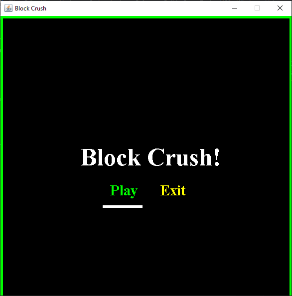
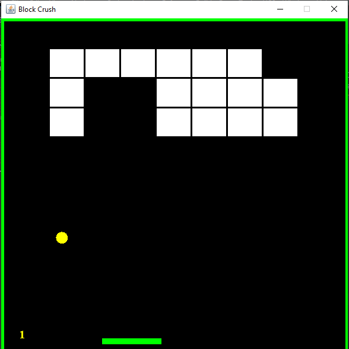
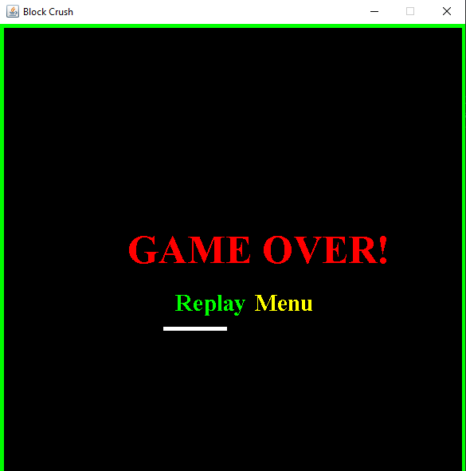

# BlockCrush-JavaGame
A GUI java retro block crush game

|Menu|GamePlay|GameOver|
|---|---|---|
||||

 

### Languages & tools :
[][java]
[][java]
  

### Directory Structure :

    |-- BlockCrush v2.0
    |
    |--.idea
    |    |-- .gitignore
    |    |-- misc.xml
    |    |-- modules.xml
    |    |-- vcs.xml
    |
    |-- out
    |    |-- BlockGenerator.class
    |    |-- GameLogic.class
    |    |-- image.jpg
    |    |-- Main.class
    |
    |-- src
    |    |-- com
    |         |-- games
    |               |-- BlockLogic.java
    |               |-- GameLogic.java
    |               |-- image.jpg
    |               |-- Main.java
    |               |-- BlockCrush v2.0.iml
    |
    |-- BlockCrush v2.0.iml

### Connect with me :  

  
 

[website]: https://abhilashtuofficial.github.io/
[java]: https://github.com/AbhilashTUofficial/java-programming

